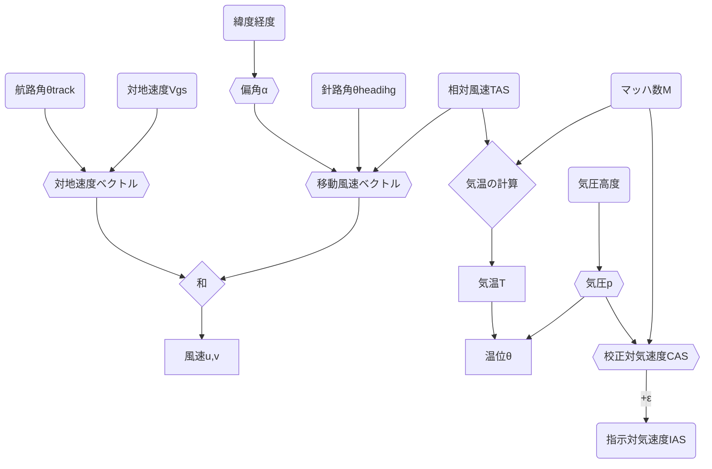

# 機能
1. reform.py: /run/dump1090-fa/history_\*.jsonを読んでデータを成型→/tmp/dump190-fa/history_\*.csv
2. watch.sh: reform.pyの実行と、history_\*.csvを合体→data.csv（crontabの設定が必要）
3. web以下のindex.html,\*.js: 可視化とそれに必要なライブラリ等

# 観測値の求め方
以下の式ではSI単位系を使う。航空業界ではヤードポンド法が使われていることが多く、dump1090の出力もヤードポンド法になっているため、途中で間違えないよう最初に変換しておく。

## 仮温度 ($T_v$)
マッハ数 $M$ は、相対風速 (True AirSpeed; TAS) と音速 $V_s$ の比で与えらえる。

$M=\frac{TAS}{V_s}$

音速の定義は比熱比 $\kappa$ 、乾燥大気の気体定数 $R$ 、仮温度 $T_v$ を用いて、

$V_s=\sqrt{\kappa RT_v}$

この2式から $T_v$ について求めると、

$T_v=\frac{TAS^2}{\kappa RM^2}=\frac{TAS^2}{1.4\times 287\times M^2}=\frac{TAS^2}{401.8M^2}$

現段階では湿度のデータは得られないため、温度に関する変数はすべて仮のものになることに注意（仮温度、仮温位...）
### 予備知識
航空機の速度はTAS以外に
- 指示対気速度 (Indicated AirSpeed; IAS)
- 較正対気速度 (Calibrated AirSpeed; CAS)
- 等価対気速度 (Equivalent AirSpeed; EAS)

がある。それぞれの速度は気圧や密度による補正がかかっている。整理すると（主にsubsonic: 0.3 < $M$ < 0.85の範囲で）

$M=\sqrt{5[(\frac{q_c}{p}+1)^\frac{2}{7}-1]}\Leftrightarrow q_c=p[(1+0.2M^2)^\frac{7}{2}-1]$

$EAS=a_0M\sqrt{\frac{p}{p_0}}=a_0\sqrt{\frac{5p}{p_0}[(\frac{q_c}{p}+1)^\frac{2}{7}-1]}$

$TAS=a_0M\sqrt{\frac{T}{T_0}}=a_0\sqrt{\frac{5T}{T_0}[(\frac{q_c}{p}+1)^\frac{2}{7}-1]} (\approx EAS\sqrt{\frac{\rho_0}{\rho}})$

$CAS=IAS+\varepsilon$（ただし、アナログ計器のときは読み値だったが、デジタル計器では補正済みかも）

$CAS=EAS[1+\frac{1}{8}(1-\frac{p}{p_0})M^2+\frac{3}{640}(1-10\frac{p}{p_0}+9(\frac{p}{p_0})^2)M^4]=a_0 M\sqrt{\frac{p}{p_0}}[1+\frac{1}{8}(1-\frac{p}{p_0})M^2+\frac{3}{640}(1-10\frac{p}{p_0}+9(\frac{p}{p_0})^2)M^4]$
1. 非圧縮 ( $M$ < 0.3) のとき2次以上の項は無視できて、CAS=EAS。このとき、 $\varepsilon$ を無視して $\rho$ をどこかからもってくればTASの式から $T$ が求められるという考えもあるが、仮定が多いわりに $M$ <0.3で上空を飛んでいることがあまりないため、今回は考えないことにする。
2. 亜音速 (subsonic: 0.3 < $M$ < 0.8) のとき、3次方程式となり解析解が求まる
3. 遷音速以上 ( $M$ > 0.8) のとき、5次方程式となり解析的に解けない

2の場合はCASとMがあればpが求まると思ったが、複素数が登場して複雑になるので諦めた。上の5次式からCASを計算に使い、IASと比較することでεとpが無視できるか検討する。

$\delta=\sqrt{\frac{p}{p_0}}$ についての3次方程式は、
$$\delta^3-(1+\frac{8}{M^2})\delta+\frac{8 CAS}{a_0 M^3}=0$$
判別式 $4(1+\frac{8}{M^2})^3-27(\frac{8 CAS}{a_0 M^3})^2>0$ が常に成り立つので、3つの異なる実数解をもつ（ $y=x^3$ を少し曲げた典型的な3次関数の形）。
$p=-(1+\frac{8}{M^2}), q=\frac{8 CAS}{a_0 M^3}$ とおくと、解は $\omega=\frac{-1+\sqrt{3}i}{2}$ を使い
$$y=\omega^k\sqrt[3]{-\frac{q}{2}+\sqrt{(\frac{q}{2})^2+(\frac{p}{3})^3}}+\omega^{3-k}\sqrt[3]{-\frac{q}{2}-\sqrt{(\frac{q}{2})^2+(\frac{p}{3})^3}}  (k=0,1,2)$$
 ここで $(\frac{q}{2})^2+(\frac{p}{3})^3=(\frac{4 CAS}{a_0 M^3})^2-\frac{(1+\frac{8}{M^2})^3}{27}<0$ なので解の途中式に虚数が出てくる。虚数を含まないよう変形するのは難しそう（還元不能）なので、複素数を扱える言語で解く必要がある。

これにより、MとCAS (≈IAS) があればpが求まる。2高度でのpとTの値があれば、静水圧平衡から密度（湿度）が求められると考える。（Tを乾燥大気として推定しているところを解決しないと不整合が出るかも）

## 気圧 ($p$)
航空機の高度には
- 幾何高度 (geometric alttitude)：GNSSで求めた高度
- 気圧高度 (pressure/barometric alatitude)：気圧計から推定した高度
がある。気圧高度は標準大気のプロファイルを用いて気圧→高度の変換を行っているので、気圧高度から気圧を求められるはず。つまり
1. 対流圏 (0< $z$ <11.019km) では $p=101325\times(1-\frac{0.0065z_p}{288.15})^\frac{9.80665}{287\times0.0065}$
2. 対流圏界面 (11.019< $z$ <20.063km) では $p=22632\times e^\frac{(11019-0.3048z_p)*9.80665}{287\times216.65}$

で計算する。求めた $p$ の妥当性はIASとCASの比較等により検証する。

## 風速 (U,V)
飛行機は風の影響を受けながら進むため、対地速度 $V_g$ は飛行機自体の速度 $V_t$ と風速 $V$ の合計になる。

$\mathbf{V}_g=\mathbf{V}_t+\mathbf{V}$

よって、風速は

$u=u_g-u_t=V_{gs}\sin\theta_{track}-V_{TAS}\sin(\theta_{heading}+\alpha)$

$v=v_g-v_t=V_{gs}\cos\theta_{track}-V_{TAS}\cos{(\theta_{heading}+\alpha)}$

ここで $V_{gs}$ 、 $V_{TAS}$ はそれぞれ対地速度と相対風速、 $\theta_{track}$ と $\theta_{heading}$ はそれぞれtrack angle（航路）とheading angle（針路）に対応する。

αは地磁気偏角で、緯度、経度、高度、時間によって決まる。NOAAのサイト (https://www.ngdc.noaa.gov/geomag/calculators/magcalc.shtml) で計算できる。WMM2020から求められている (https://www.adsbexchange.com/ads-b-data-field-explanations/) とのことなので、2020年1月1日における高度10kmの10度ごとの値を取得し、内挿により求める。
- 今後基準とするモデルが変わったら適宜更新が必要。
- 10度ごとからの内挿なので、誤差が含まれる（特に低緯度で大きそう）
- 鉛直方向の運動は（今のところ）無視している。
- 高度による違いも無視（ほぼ地表なので、水平位置による違いの方が大きい）

参考文献：Haan et al (2011) https://agupubs.onlinelibrary.wiley.com/doi/full/10.1029/2010JD015264

## 計算の流れ

