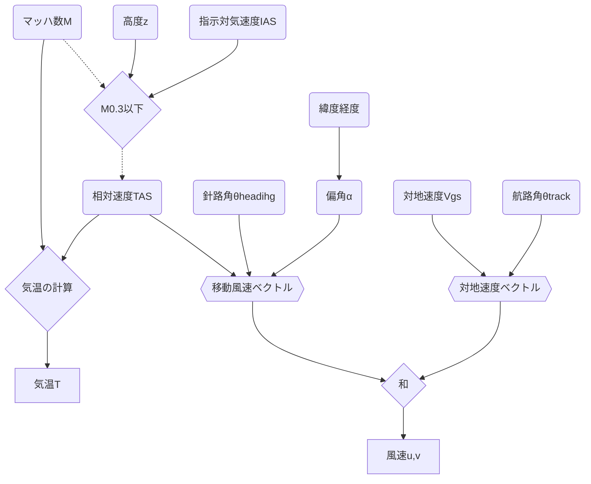

# 機能
1. reform.py: history_\*.jsonを読んでデータを成型→history_\*.csv
2. watch.sh: reform.pyの実行と、history_\*.csvを合体→data.csv（crontabの設定が必要）
3. web以下のindex.html,\*.js: 可視化とそれ必要なライブラリ等

# 観測値の求め方
以下の式ではSI単位系を使う。航空業界ではヤードポンド法が使われていることが多いため途中で間違えないよう最初に変換しておく。
## 気温 (T)
マッハ数 $M$ は、相対風速 (True AirSpeed; TAS) と音速*V*sの比で与えらえる。

$M=\frac{TAS}{V_s}$

音速の定義は比熱比κ、乾燥空気の気体定数R、気温*T*を用いて、

$V_s=\sqrt{\kappa RT}$

この2式から*T*について求めると、

$T=\frac{TAS^2}{\kappa RM^2}=\frac{TAS^2}{1.4\times 287\times M^2}=\frac{TAS^2}{401.8M^2}$

### 予備知識
航空機の速度はTAS以外に
- 指示対気速度 (Indicated AirSpeed; IAS) 
- 較正対気速度 (Calibrated AirSpeed; CAS) 
- 等価対気速度 (Equivalent AirSpeed; EAS) 

がある。それぞれの速度は気圧や密度による補正がかかっている。整理すると（主にsubsonic: 0.3 < M < 0.85の範囲で）

$M=\sqrt{5[(\frac{q_c}{p}+1)^\frac{2}{7}-1]}\Leftrightarrow q_c=p[(1+0.2M^2)^\frac{7}{2}-1]$

$EAS=a_0M\sqrt{\frac{p}{p_0}}=a_0\sqrt{\frac{5p}{p_0}[(\frac{q_c}{p}+1)^\frac{2}{7}-1]}$

$TAS=EAS\sqrt{\frac{\rho_0}{\rho}}=a_0M\sqrt{\frac{T}{T_0}}=a_0\sqrt{\frac{5T}{T_0}[(\frac{q_c}{p}+1)^\frac{2}{7}-1]}$

$CAS=IAS+\alpha\approx IAS$ （αは機体の特性による補正とのことだが、IASをブロードキャストしても意味がないのでCASと考えることにする）

$CAS=EAS[1+\frac{1}{8}(1-\frac{p}{p_0})M^2+\frac{3}{640}(1-10\frac{p}{p_0}+9(\frac{p}{p_0})^2)M^4]=a_0 M\sqrt{\frac{p}{p_0}}[1+\frac{1}{8}(1-\frac{p}{p_0})M^2+\frac{3}{640}(1-10\frac{p}{p_0}+9(\frac{p}{p_0})^2)M^4]$
1. 非圧縮 (M < 0.3) のとき2次以上の項は無視できて、CAS=EAS
2. 遷音速以上 (M > 0.8) のとき、5次方程式となり解析的に解けない
3. 亜音速 (subsonic: 0.3 < M < 0.8) のとき、3次方程式となり解析解が求まる

$\delta=\sqrt{\frac{p}{p_0}}$ についての3次方程式は、
$$\delta^3-(1+\frac{8}{M^2})\delta+\frac{8 CAS}{a_0 M^3}=0$$
判別式 $4(1+\frac{8}{M^2})^3-27(\frac{8 CAS}{a_0 M^3})^2>0$ が常に成り立つので、3つの異なる実数解をもつ（ $y=x^3$ を少し曲げた典型的な3次関数の形）。
$p=-(1+\frac{8}{M^2}), q=\frac{8 CAS}{a_0 M^3}$ とおくと、解は $\omega=\frac{-1+\sqrt{3}i}{2}$ を使い
$$y=\omega^k\sqrt[3]{-\frac{q}{2}+\sqrt{(\frac{q}{2})^2+(\frac{p}{3})^3}}+\omega^{3-k}\sqrt[3]{-\frac{q}{2}-\sqrt{(\frac{q}{2})^2+(\frac{p}{3})^3}}  (k=0,1,2)$$
 ここで $(\frac{q}{2})^2+(\frac{p}{3})^3=(\frac{4 CAS}{a_0 M^3})^2-\frac{(1+\frac{8}{M^2})^3}{27}<0$ なので解の途中式に虚数が出てくる。虚数を含まないよう変形するのは難しそう（還元不能）なので、複素数を扱える言語で解くことにする。

これにより、MとCAS (≈IAS) があればpが求まることになる。2高度でのpとTの値があれば、静水圧平衡から密度（湿度）が求められると考える。（Tを乾燥大気として推定しているところを解決しないと不整合が出るかも）

## 風速 (U,V)
飛行機は風の影響を受けながら進むため、対地速度**Vg**は飛行機自体の速度**Vt**と風速**V**の合計になる。

$\mathbf{V}_g=\mathbf{V}_t+\mathbf{V}$

よって、風速は

$\binom{u}{v}=\binom{u}{v}_g-\binom{u}{v}_t=\binom{V_{gs}\sin\theta_{track}-V_{TAS}\sin(\theta_{heading}+\alpha)}{V_{gs}\cos\theta_{track}-V_{TAS}\cos{(\theta_{heading}+\alpha)}}$

ここで*V*gs、*V*TASはそれぞれ対地速度と相対風速、*θ*trackと*θ*headingはそれぞれtrack angle（航路）とheading angle（針路）に対応する。

αは地磁気偏角で、緯度、経度、高度、時間によって決まる。NOAAのサイト (https://www.ngdc.noaa.gov/geomag/calculators/magcalc.shtml) で計算できる。今回は2020年1月1日における高度10kmの10度ごとの値を取得し、内挿により求める。
- 数年のスケールでは問題ないと思われるが、地磁気は変化するので適宜更新が必要。
- この方法では細かい水平構造（例えばhttps://www.gsi.go.jp/common/000237171.pdf） は再現できていないと思われる。
- 風速の不確実性の原因にはなると思われる。
- 鉛直方向の運動は（今のところ）無視している。

参考文献：Haan et al (2011) https://agupubs.onlinelibrary.wiley.com/doi/full/10.1029/2010JD015264

## 計算の流れ

