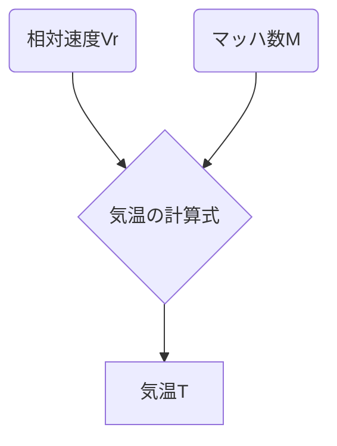

# 機能
1. reform.py: history_\*.jsonを読んでデータを成型→history_\*.csv
2. watch.sh: reform.pyの実行と、history_\*.csvを合体→data.csv（crontabの設定が必要）
3. index.html,\*.js: 可視化

# 観測値の求め方
## 気温 (T)
マッハ数Mは、相対風速Vrと音速Vsの比で与えらえる。

音速の定義は比熱比κ、乾燥空気の気体定数R、気温Tを用いて、

この2式からTについて求めると、

https://doi.org/10.1371/journal.pone.0205029 ここにはもう少し詳しい求め方が載っている（マッハ数で条件分岐する）

## 風速 (U,V)

