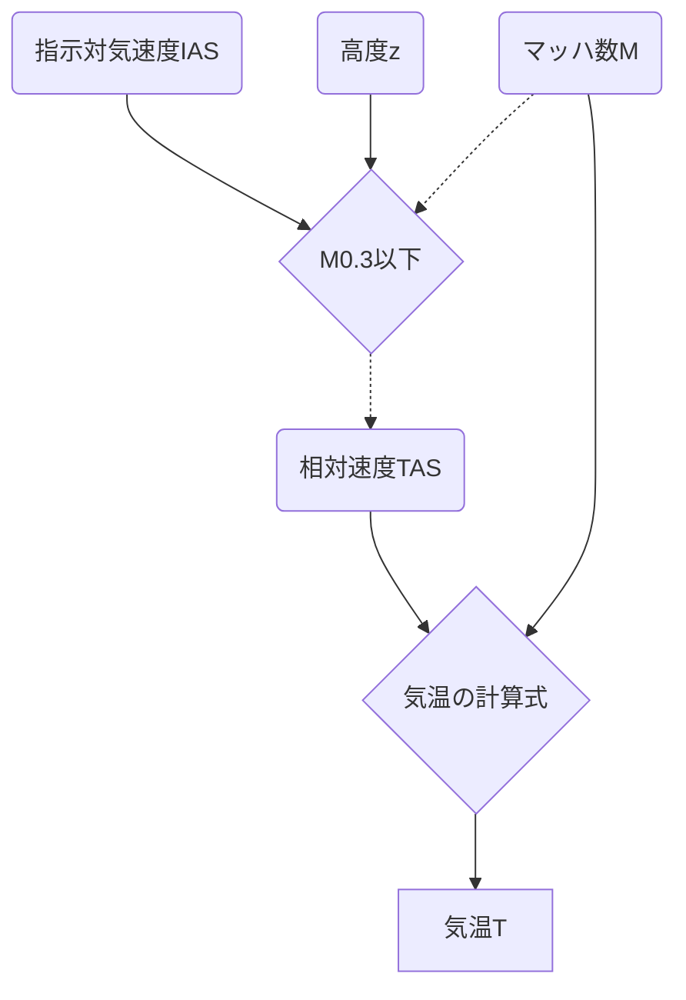

# 機能
1. reform.py: history_\*.jsonを読んでデータを成型→history_\*.csv
2. watch.sh: reform.pyの実行と、history_\*.csvを合体→data.csv（crontabの設定が必要）
3. index.html,\*.js: 可視化

# 観測値の求め方
## 気温 (T)
マッハ数Mは、相対風速 (True AirSpeed; TAS) と音速Vsの比で与えらえる。

音速の定義は比熱比κ、乾燥空気の気体定数R、気温Tを用いて、

この2式からTについて求めると、

### 予備知識
航空機の速度はTAS以外に
- 指示対気速度 (Indicated AirSpeed; IAS) 
- 較正対気速度 (Calibrated AirSpeed; CAS) 
- 等価対気速度 (Equivalent AirSpeed; EAS) 

がある。これら3種はほぼ同じ値で（厳密には異なる）、TASがなくてもIASのデータが得られることがある。そこで、IASを用いて気温を求める方法を考える。大気の圧縮性を無視できるとき（M≦0.3: https://ja.wikipedia.org/wiki/マッハ数 ）、IASとTASの関係は以下のように与えられる。(https://en.wikipedia.org/wiki/Equivalent_airspeed)

大気の密度ρは等温を仮定すると、地上での密度ρ0からスケールハイトHを使って高度zとともに指数関数的に減少する。

これを代入すると

Tを求める式は、

ここで、気温約273K（仮定）のとき、Hは8000m。

大気の圧縮性を無視できないとき (M>0.3) はIASとTASの変換式は使えず、TASとMからTを求める式をTASについて変形した形

で求める。この式でTは求められないので、TASの情報がないときにIASから気温を求められるのはM≦0.3のときに限られる。実際に上空を航行しているときはほとんどM>0.3なので、今回は実装しない。

## 風速 (U,V)

